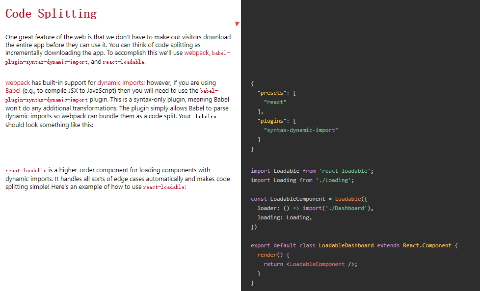

### 基本用法
```
import { BrowserRouter } from 'react-router-dom';
// Route 的 component 和 render 属性比 children 优先级要高，因此每个 Route 只能使用一个属性
// 这样 FinancialDataMaintain 组件相当于对应 /financialDataMantain 路径，作为 layout 的话跟 2.x 3.x 作用类似，这样使用比较方便
// 如果 FinancialDataMaintain 较复杂，进入子路由（如 /financialDataMantain/importData）后渲染其他组件（如 ImportData），会看起来不太直观，因为这时渲染的组件要到这边来找
// 子路由应该可以使用 match 参数，match.url 来拼接 url
const RouteMap = () => (
    <BrowserRouter>
        <Route component={props => (
            <App {...props}>
                <Switch>
                    <Route path="/" exact component={StatisticsSetting} />
                    <Route path="/statisticsSetting" component={StatisticsSetting} />
                    <Route path="/orderManage" component={OrderManage} />
                    <Route path="/buyData" component={BuyData} />
                    <Route path="/financialDataMantain" children={({ match, ...rest }) => (
                        <FinancialDataMaintain>
                            <Route path={`${match.url}/importData`} component={ImportData} replace />
                            <Route path={`${match.url}/price`} component={Price} replace />
                        </FinancialDataMaintain>
                    )} />
                    <Route path="/saas" component={Saas} />
                    <Route component={NotFound} />
                </Switch>
            </App>
        )} />
    </BrowserRouter>
);

React.render((
  RouteMap
), document.body)

//  router-config.js
const routes = [
  {
    path: "/sandwiches",
    component: Sandwiches
  },
  {
    path: "/tacos",
    component: Tacos,
    routes: [
      {
        path: "/tacos/bus",
        component: Bus
      },
      {
        path: "/tacos/cart",
        component: Cart
      }
    ]
  }
];

// sub routes are added to any route it'll work
const RouteWithSubRoutes = route => (
  <Route
    path={route.path}
    render={props => (
      // pass the sub-routes down to keep nesting
      <route.component {...props} routes={route.routes} />
    )}
  />
);

const RouteConfigExample = () => (
  <Router>
    <div>
      <ul>
        <li>
          <Link to="/tacos">Tacos</Link>
        </li>
        <li>
          <Link to="/sandwiches">Sandwiches</Link>
        </li>
      </ul>

      {routes.map((route, i) => <RouteWithSubRoutes key={i} {...route} />)}
    </div>
  </Router>
);

export default RouteConfigExample;
```

### 组件
##### BrowserRouter
1. basename: string
作用：为所有位置添加一个基准URL
使用场景：假如你需要把页面部署到服务器的二级目录，你可以使用 basename 设置到此目录。
2. getUserConfirmation: func
作用：导航到此页面前执行的函数，默认使用 window.confirm
使用场景：当需要用户进入页面前执行什么操作时可用，不过一般用到的不多。
3. forceRefresh: bool
作用：当浏览器不支持 HTML5 的 history API 时强制刷新页面。
使用场景：同上。
4. keyLength: number
作用：设置它里面路由的 location.key 的长度。默认是6。（key的作用：点击同一个链接时，每次该路由下的 location.key都会改变，可以通过 key 的变化来刷新页面。）
使用场景：按需设置。
5. children: node
作用：渲染唯一子元素。
使用场景：作为一个 React组件，天生自带 children 属性。
##### ~~HashRouter~~ (不推荐使用)
##### Route
<Route>组件有如下属性：
```
path（string）: 路由匹配路径。（没有path属性的Route 总是会 匹配）；
exact（bool）：为true时，则要求路径与location.pathname必须完全匹配；
strict（bool）：true的时候，有结尾斜线的路径只能匹配有斜线的location.pathname；
```

自带三个 render 方法 和三个 props
> render methods 分别是：
```
<Route component>：在地址匹配的时候React的组件才会被渲染，route props也会随着一起被渲染；
<Route render>：这种方式对于内联渲染和包装组件却不引起意料之外的重新挂载特别方便；
<Route children>：与render属性的工作方式基本一样，除了它是不管地址匹配与否都会被调用；
```
> props 分别是：
```
match
location
history
```
##### Switch
只渲染出第一个与当前访问地址匹配的 <Route> 或 <Redirect>。
如下代码：如果你访问 /about，那么组件 About User Nomatch 都将被渲染出来，因为他们对应的路由与访问的地址 /about 匹配。
```
<Route path="/about" component={About}/>
<Route path="/:user" component={User}/>
<Route component={NoMatch}/>
```
##### Redirect
##### Link
##### NavLink 
这是 <Link> 的特殊版，顾名思义这就是为页面导航准备的。因为导航需要有 “激活状态”。
```
<NavLink
  to="/about"
  activeClassName="selected"
  activeStyle={{ color: 'green', fontWeight: 'bold' }}
>MyBlog</NavLink>
```

### 按需加载

```
{
  "presets": [
    "react"
  ],
  "plugins": [
    "syntax-dynamic-import"
  ]
}

import Loadable from 'react-loadable';
import Loading from './Loading';

const LoadableComponent = Loadable({
  loader: () => import('./Dashboard'),
  loading: Loading,
})

export default class LoadableDashboard extends React.Component {
  render() {
    return <LoadableComponent />;
  }
}
```

### 路由钩子
去除
